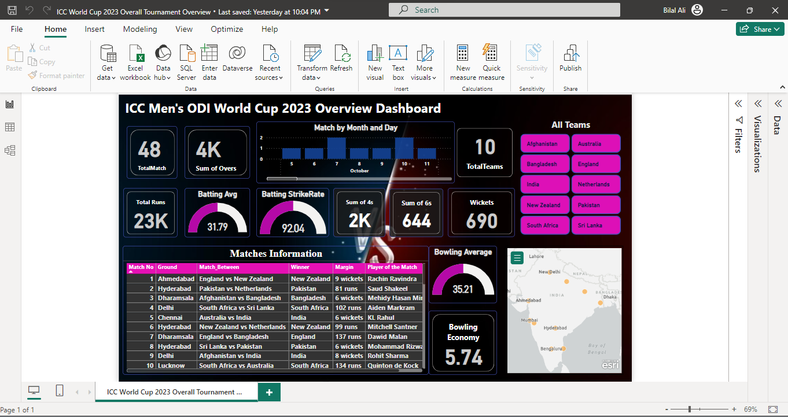

# ICC Men's ODI World Cup 2023 - Tournament Overview Dashboard

This repository contains the Power BI project files and related assets for analyzing the ICC Men's ODI World Cup 2023.

## Contents

- `ICC World Cup 2023 Overall Tournament Overview.pbix`: Power BI file with the overall tournament analysis.
- `odi world cup 2023 dataset.zip`: Dataset files used in the analysis.
- `Afghanistan.png`, `Australia.png`, `Bangladesh.png`, ..., `Netherlands.png`: Screenshots for each team's overview.
- `overall-overview.png`: Screenshot of the overall tournament overview.

## How to Use

1. Download the Power BI file (`ICC World Cup 2023 Overall Tournament Overview.pbix`).
2. Extract the dataset files from `odi world cup 2023 dataset.zip`.
3. Open the Power BI file to explore the tournament analysis.

## Team Overviews

- [Afghanistan Overview](Afghanistan.png)
- [Australia Overview](Australia.png)
- [Bangladesh Overview](Bangladesh.png)
- [England Overview](England.png)
- [India Overview](India.png)
- [Netherlands Overview](Netherlands.png)
- [New Zealand Overview](New-Zealand.png)
- [Pakistan Overview](Pakistan.png)
- [South Africa Overview](South-Africa.png)
- [Sri Lanka Overview](Sri-Lanka.png)

## Screenshots

## Note

Feel free to explore the detailed Power BI project for more insights. If you have any questions or suggestions, please open an issue.

Happy Analyzing!
